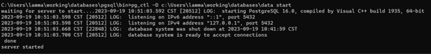
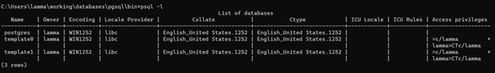
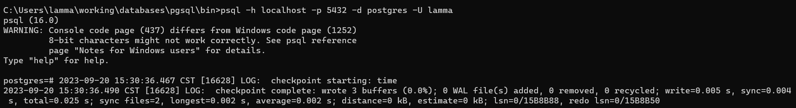
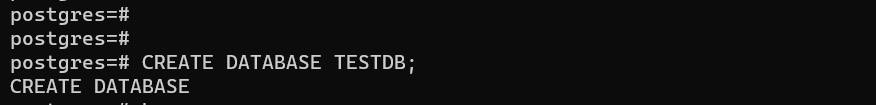
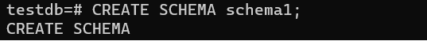
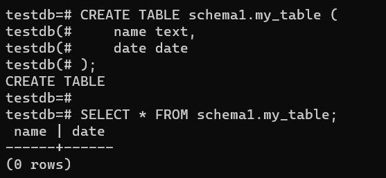
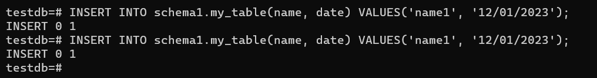
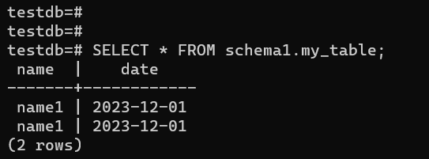

## How to Run Postgres from Binary Package on Window 11

This is a brief summary about postgres database and how to run it from binary package without installation.
#### 1. Introduction
Database is a collection of information which are stored in some specific structures. These structures are supported by database management system (DBMS), which is responsible for managing the storage, retrieval, modification, and deletion of data in the database.
Some common types of databases: 
* relational databases
* NoSQL databases
* object-oriented databases
* hierarchical databases
* network databases

Postgres is an Object-Relational Database (ORD). It combines the features of both relational and object-oriented databases, which means that objects, classes, and inheritance are directly supported in database schemas and in the query language.
#### 2. Prerequisites
* 1 GHz processor
* 2 GB of RAM
* 512 MB of HDD
#### 3. Downloading the Binary Package
Download the file at https://www.enterprisedb.com/download-postgresql-binaries
#### 4. Installing PostgreSQL
* Extracting the source to your desired location. Ex: C:\databases\postgres
* Creating a folder for storing database files. Ex: C:\databases\data
* Creating a database cluster.
  initdb -D C:\databases\data

#### 5. Starting database server
After finishing running the initdb. All configuration for the database cluster are created in the C:\databases\data folder. The next step is starting the posstgres server.
pg_ctl -D "C:\databases\data" logfile start

#### 6. Testing the Installation
* Checking all pre created databases on the server
psql -l

* Connecting to postgres database
psql -h localhost -p 5432 -d postgres -U lamma
-h: hostname
-p: port
-d: databasename
-U: ownername

* Creating new database;
CREATE DATABASE testdb

* Switching to new created database
\c testdb

* Creating schema
CREATE SCHEMA schema1;

* creating tables
CREATE TABLE schema1.my_table (
    name text,
    date date
);

* Inserting data into the table
INSERT INTO schema1.my_table(name, date) VALUES('name1', '12/01/2023');
INSERT INTO schema1.my_table(name, date) VALUES('name1', '12/01/2023');

* Query inserted data
SELECT * FROM schema1.my_table;

