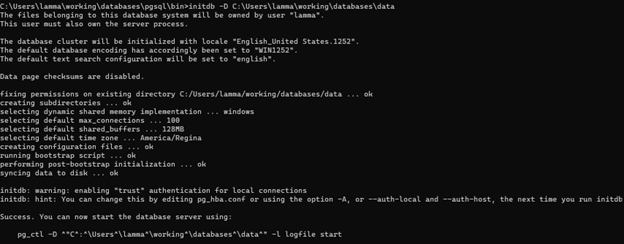

## How to Run Postgres from Binary Package on Window 11
#### 1. Introduction
Database is a collection of information which are stored in some specific structures. These structures are supported by database management system (DBMS), which is responsible for managing the storage, retrieval, modification, and deletion of data in the database.
Some common types of databases: 
* relational databases
* NoSQL databases
* object-oriented databases
* hierarchical databases
* network databases

Postgres is an Object-Relational Database (ORD). It combines the features of both relational and object-oriented databases, which means that objects, classes, and inheritance are directly supported in database schemas and in the query language.
#### 2. Prerequisites
* 1 GHz processor
* 2 GB of RAM
* 512 MB of HDD
#### 3. Downloading the Binary Package
Download the file at https://www.enterprisedb.com/download-postgresql-binaries
#### 4. Installing PostgreSQL
* Extracting the source to your desired location. Ex: C:\databases\postgres
* Creating a folder for storing database files. Ex: C:\databases\data
* Creating a database cluster.
  initdb -D C:\databases\data

#### 5. Starting database server

#### 6. Testing the Installation
